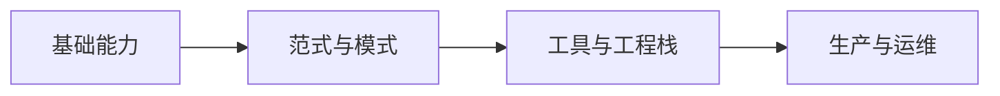

# Agent 开发学习路线

本文档与学习实验代码同放于「Agent开发学习实验」文件夹，可按阶段边看边跑示例。

---

## 路线总览

建议总时长：全职约 **3–6 个月**（按每周 15–25 小时）；业余可拉长到 **6–12 个月**。每一阶段都以「小项目」闭环，避免只看不练。

---

## 阶段 0：前置基础（1–2 周）

**目标**：能读懂模型行为、会写可靠提示，并具备基本 Python/TypeScript 异步与 API 调用能力。

- **LLM 基础**：token、上下文窗口、温度与采样、多轮对话与 system/user 角色。
- **提示工程**：任务分解、少样本（few-shot）、链式提示、输出格式约束（JSON/工具调用风格）。
- **工程**：HTTP API 调用、环境变量与密钥管理、`async/await`、简单日志。

**检验**：用任意 API 实现一个「多步问答」脚本（例如先总结再翻译），并能把中间步骤结构化输出。

---

## 阶段 1：Agent 核心概念（2–3 周）

**目标**：理解「模型 + 规划 + 工具 + 记忆」这条主线，而不是把 Agent 当成「多轮聊天」。

- **范式**：ReAct（推理-行动循环）、Plan-and-Execute、Reflexion 等思路（不必死记论文，重在何时用）。
- **工具（Tools）**：函数描述 schema、让模型选工具 vs 固定流水线；错误处理与重试。
- **记忆**：短期（对话窗口）、长期（向量库/摘要）、何时写记忆、如何避免污染上下文。
- **RAG 入门**：分块、嵌入、检索；Agent 何时该「先检索再答」vs「边想边查」。

**检验**：实现一个「可调用 2–3 个假工具」（天气、计算器、搜索 mock）的循环 Agent，并记录每步 thought/action/observation。

---

## 阶段 2：框架选一深修（3–5 周）

**目标**：用一套成熟抽象把 Graph/状态机、工具路由、流式输出跑通；不必每个框架都学。

**常见选型（选一个为主）**：

| 方向 | 适合 | 备注 |
|------|------|------|
| **LangGraph**（或 LangChain 生态） | Python 为主、工作流图清晰 | 状态图、人机在中断点、多 Agent 协作 |
| **Semantic Kernel / AutoGen** | 企业 .NET/Python、多 Agent | 按目标栈选 |
| **TypeScript** | 全栈/前端驱动 | 查当前主流 TS Agent 库（生态变化快，以官方文档为准） |

**检验**：做一个 **带状态 persisted** 的对话 Agent（例如「旅行规划助手」）：能分步收集信息、调用工具查假数据、最后生成结构化行程；支持从中间步骤恢复或人工纠错（若框架支持 interrupt）。

---

## 阶段 3：与真实世界对接（2–4 周）

**目标**：Agent 能安全、稳定地使用外部系统。

- **MCP（Model Context Protocol）**：用标准方式暴露工具与资源；理解 server/client 边界（若在 Cursor/IDE 场景，与本地能力结合）。
- **鉴权与限流**：OAuth/API Key、每用户配额；工具调用失败时的降级策略。
- **结构化输出**：JSON Schema / 函数调用；解析失败时的自我修复一轮。
- **评测**：少量 gold cases + LLM-as-judge 的利弊；更重视 **轨迹级** 评测（是否调对了工具、是否早停）。

**检验**：接 1 个真实只读 API（如公开天气/新闻 API），加单测或固定 fixture 测工具选择与解析。

---

## 阶段 4：生产级 Agent（3–6 周）

**目标**：可观测、可回滚、成本可控。

- **可观测性**：trace id、每步延迟与 token、工具调用日志；OpenTelemetry 或平台自带。
- **安全**：提示注入、工具权限最小化、敏感数据不出上下文；人工审核关键点（尤其是写操作）。
- **成本与延迟**：模型路由（小模型分类/大模型生成）、缓存、长上下文裁剪与摘要策略。
- **人机协作**：确认再执行、草稿再提交、任务队列与异步作业。

**检验**：给一个 Agent 加 **dashboard 或最少结构化日志**；设计 3 类失败注入（工具超时、胡言乱语、注入攻击）并观察行为。

---

## 阶段 5：专精与前沿（持续）

按兴趣选 1–2 条纵深即可：

- **多 Agent 系统**：角色分工、共享黑板、冲突解决（易过度设计，先证明单 Agent 不够）。
- **代码 Agent / IDE 集成**：若使用 Cursor 生态，可结合官方文档学习 **Cursor SDK、hooks、MCP**（与「通用 LLM Agent」互补）。
- **语音/多模态 Agent**：另一条独立分支，需另加 ASR/TTS 与流式管线知识。

---

## 推荐学习顺序小结

1. LLM + 提示 + API 基础  
2. ReAct 循环 + 工具 + 简单记忆 + RAG  
3. 选一个框架做完整项目（状态 + 工具 + 评测）  
4. MCP/真实 API + 安全 + 观测 + 成本  

---

## 练习项目阶梯（递增难度）

1. **CLI 工具调用 Agent**（mock 工具）  
2. **RAG + Agent**（自有文档库问答）  
3. **带审批的写操作 Agent**（例如生成邮件草稿，发送前确认）  
4. **小型「研究助手」**（多源检索、引用出处、禁止幻觉的护栏）  

---

## 资源类型建议

- 各框架 **官方文档与 cookbook** 优先于杂散博客。  
- 论文以 **精读 2–3 篇经典**（如 ReAct、tool use 相关）即可，其余用综述或课程。  
- 社区示例仓库选 **最近 6–12 个月仍维护** 的，避免过时 API。  
