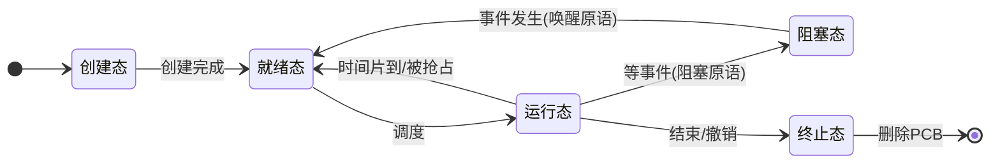

# 操作系统原理

## 一、操作系统的概念 功能

### **1.1操作系统的概念、定义**

------

**操作系统** 是指控制和**管理**整个计算机系统的**硬件**和**软件**资源，并合理地组织调度计算机的工作和资源的分配；以**提供给用户和其他软件方便的接口和环境**；它是计算机系统中最基本的**系统软件**。

- 操作系统是系统资源的管理者
- 向上层提供方便易用的服务
- 是最接近硬件的一层软件

------

### 1.2系统资源的管理者

提供的**功能**：

- 处理机管理
- 存储器管理
- 文件管理
- 设备管理

------

### 1.3向上层提供方便易用的服务

> 封装思想

1. GUI （图形化用户接口）

   用户可以在形象的图形界面进行操作，不需要记忆复杂的命令、参数

2. 联机命令接口  =  **交互式**命令接口  （用户说一句系统做一句）

   例：

​	3.脱机命令接口 = **批处理**命令接口（用户说一堆，系统做一堆）

​	4.程序接口： 可以在程序中进行系统调用使用程序接口，*普通用户无法直接使用*

​		如：在c语言用 printf函数的时候，底层使用了操作系统提供的显式相关的“系统调用”

### 1.4作为最接近硬件的层次

需要实现对硬件机器的拓展

没有任何软件支持的计算机成为**裸机**。在裸机上安装的操作系统，可以提供资源管理功能和方便用户的服务功能，将裸机改造成功能更强、使用更方便的机器。

通常把覆盖了软件的机器成为**扩充机器**，又称之为**虚拟机**。

## 二、操作系统的特征

- **并发**
- **共享**
- 虚拟
- 异步

> 并发和共享是最基本条件，二者互为存在条件

### 2.1并发

并发：两个或多个事件在同一时间间隔内发生，**宏观**上是**同时**发生的，**微观**上是**交替发生**的

并行：两个或多个事件在同一时刻同时发生

**操作系统的并发性**指计算机系统中 “同时” 运行着多个程序，这些程序宏观上看是同时运行着的，而微观上看是交替运行的。

多核CPU可以并行的执行任务

单核CPU只能并发的进行

### 2.2共享

共享即资源共享，是指系统中的资源可供内存中多个并发执行的进程共同使用

- 互斥共享方式：QQ 微信视频聊天，摄像头只能分配给其中一个
- 同时共享方式： 用QQ 微信 同时发送文件，两个进程是交替访问硬盘的

### 2.3虚拟

虚拟是指把一个物理上的实体变为若干个逻辑上的对应物。物理实体（前者）是实际存在的，而逻辑上对应物（后者）是用户感受到的。

实现虚拟性的主要技术是**复用**：

- **空分复用技术（空间分割复用）**  
  把一份**空间资源**在逻辑上划分成多份，供多个用户或进程“同时”使用。典型例子：**虚拟存储器**。  
  物理内存只有一块，但通过请求分页、请求分段等机制，每个进程感觉自己拥有一片很大的、连续的地址空间；实际只有部分页面在内存中，其余在外存，需要时再调入。这样就把“有限的物理内存”虚拟成了“多个各自独立的逻辑地址空间”。

- **时分复用技术（时间分割复用）**  
  把**时间**切成小片，轮流把 CPU 交给不同进程使用。典型例子：**虚拟处理器**。  
  单核 CPU 在任一时刻只能执行一个进程，但通过时间片轮转等调度，多个进程交替运行，宏观上就像“每个进程都有一台处理器”。这是**并发**的基础之一。

### 2.4异步

**异步性**是指：进程的执行不是一贯到底、而是以“走走停停”的方式推进；何时执行、何时暂停、速度多快，都**不可精确预知**。

原因主要有两点：

1. 多个进程**并发**共享资源，何时获得 CPU、何时因等待 I/O 或锁而阻塞，由调度与竞争情况决定。  
2. **中断**随时可能发生，打断当前执行流，转入内核处理后再返回。

异步性对**用户程序**的影响：只要运行环境相同，程序多次运行的**结果**应当一致（确定性），但**完成时间**、**中间停顿的位置**可以不同。操作系统要在这种不确定的执行次序下，仍能保证**正确性**（例如通过同步机制避免竞态条件）。

---

## 三、操作系统的发展与分类

### 3.1手工操作阶段

早期无操作系统：程序员预约上机，人工装纸带/卡片，CPU 在装卸与调试期间大量空闲，**人机速度矛盾**突出，资源利用率极低。

### 3.2批处理阶段

把一批作业交给监督程序自动依次处理，减少人工干预。

- **单道批处理系统**  
  内存中**同一时刻只有一道**用户作业。作业成批输入，CPU 与内存利用率比手工阶段好，但 I/O 慢时 CPU 仍会长时间等待（**CPU 与 I/O 设备串行**）。

- **多道批处理系统**  
  内存中**同时驻留多道**程序。某程序因 I/O 阻塞时，CPU 可切换去执行另一道程序，**提高资源利用率和系统吞吐量**。  
  特点：用户**不能直接干预**运行中的作业；周转时间可能较长；**无交互能力**（不适合调试和即时操作）。  
  多道程序设计是现代 OS **并发、共享**思想的直接来源。

### 3.3分时操作系统

把 CPU 时间划分为**时间片**，多个终端用户通过**交互**方式轮流使用。  
**目标**：响应快、**公平**、人机交互友好。典型： UNIX/Linux 的交互式使用方式。

与批处理对比：强调**及时响应**和**交互**，牺牲部分吞吐以换取用户体验。

### 3.4实时操作系统

必须在**规定时间**内完成处理，否则可能造成严重后果或系统失效。

- **硬实时**：超过时限会导致**灾难性后果**（如飞行控制、工业安全联锁），时限必须严格满足。  
- **软实时**：偶尔超时**可容忍**但会降低服务质量（如流媒体、在线游戏），尽量满足时限。

实时系统通常采用**可预测**的调度策略，减少不必要的复杂功能以保证时间行为确定。

### 3.5网络操作系统与分布式操作系统

- **网络操作系统**  
  在**网络环境**中实现通信、资源共享（如远程登录、文件共享），各节点往往仍有**独立的本地 OS**，通过网络协议协作。

- **分布式操作系统**  
  对用户呈现为**单一系统映像**：多台机器在 OS 层面紧密协作，资源共享与任务分配对用户更透明，一致性和容错设计更复杂。

### 3.6个人计算机操作系统

面向单用户或少量用户，注重**图形界面、易用性、多媒体、设备即插即用**。如 Windows、桌面版 macOS/Linux。

---

## 四、操作系统的运行机制

### 4.1内核程序与应用程序

- **内核程序（Kernel）**  
  由操作系统实现者编写，组成**操作系统内核**。负责资源管理、中断处理、进程调度、内存管理等**核心**功能

- **应用程序**  
  普通用户或第三方开发，运行在 OS 提供的环境之上，**不能**随意访问硬件或破坏其他进程。

### 4.2特权指令与非特权指令

- **特权指令**  
  仅允许在**内核态**执行，如：关中断、修改页表基址寄存器、I/O 指令、清内存、设置时钟等。若用户程序随意执行，会破坏系统安全与多道程序隔离。

- **非特权指令**  
  普通算术、逻辑、访存（在用户态合法地址范围内）等，**用户态**即可执行。

### 4.3内核态与用户态（管态与目态）

- **内核态（核心态、管态）**  
  执行内核代码，**可以**执行特权指令，可访问所有受保护资源。

- **用户态（目态）**  
  执行用户程序，**只能**执行非特权指令；若试图执行特权指令，会触发**异常**，由硬件截获并转入 OS 处理。

**PSW（程序状态字）** 等寄存器中通常有**一位**（或若干相关位）表示当前是内核态还是用户态。模式切换时硬件会更新该位。

### 4.4内核态与用户态的切换

典型路径：

1. **用户态 → 内核态**  
   - **中断**：如时钟中断、I/O 完成中断、缺页异常等，硬件保存现场后跳转到**中断服务程序**（在内核）。  
   - **异常**：执行非法指令、除零、缺页等。  
   - **陷入（trap）**：用户程序执行**陷入指令**（如系统调用），**主动**请求 OS 服务。注意：**陷入指令本身不是特权指令**，用户态可以执行，执行后 CPU 会进入内核态。

2. **内核态 → 用户态**  
   中断/异常/系统调用处理完毕，执行**返回用户程序**的指令（如 iret），恢复用户现场并清除内核态标志。

**要点**：从用户态进入内核态后，由**操作系统**接管；何时切回、如何调度，由内核逻辑决定。这是 OS **介入**管理的关键机制之一。

---

## 五、中断和异常

“中断”一词在教材里常分**广义**：包含**外中断（狭义的中断）**和**内中断（异常）**。

### 5.1中断的作用

1. **实现多道程序与分时**：时钟中断驱动调度，使 CPU 在进程间切换。  
2. **实现用户态与内核态切换**：陷入、异常、外中断都会进入内核处理路径。  
3. **提高 I/O 效率**：设备就绪后以中断通知 CPU，避免忙等。  
4. **处理故障**：非法指令、缺页等通过异常进入内核，由 OS 处理或终止进程。

### 5.2中断类型

#### （1）内中断（异常）——由 CPU 内部事件引起，与当前指令执行相关

- **陷入（trap）、自陷**  
  用户**有意**执行**陷入指令**引发，用于**系统调用**。陷入指令**不是特权指令**（用户态可执行），执行后进入内核执行相应服务。

- **故障（fault）**  
  可能被修复后**重新执行**当前指令。例如**缺页**：处理完调入页面后，返回用户程序时**重新执行**引起缺页的那条指令。

- **终止（abort）**  
  严重错误，无法恢复当前程序执行，通常**终止**该进程。如硬件故障、双重缺页等。

#### （2）外中断（狭义的中断）——来自 CPU 外部，与当前指令无必然对应关系

- **时钟中断**：用于计时、时间片到期、更新系统时间等。  
- **I/O 中断**：设备完成数据传输、就绪或出错时通知 CPU。

区分记忆：**异常**常与**某条指令**绑定；**外中断**与指令流**异步**，在指令边界上响应。

### 5.3中断机制的基本原理

1. **检测**：每条指令执行结束后，CPU 检查是否有中断/异常pending。  
2. **响应**：关中断（或保存状态）、保存**断点**与**程序状态字**、根据**中断号**查找入口。  
3. **中断向量表**：内存中一张表，每项对应一种中断/异常类型，存放**处理程序入口地址**（及可能的其他信息）。硬件用**中断向量号**索引该表，**快速跳转**到对应服务程序。  
4. 处理完成后**恢复现场**，开中断，返回被中断的程序（或切换到另一进程）。

---

## 六、系统调用

### 6.1什么是系统调用

**系统调用**是操作系统向用户程序提供的**编程接口**：用户程序请求 OS 代为完成**特权级操作**（如创建文件、读写设备、创建进程），通过陷入进入内核，由内核**可信代码**执行。

### 6.2库函数与系统调用

用户常通过**库函数**（如 C 标准库）间接使用系统调用。例如“创建新文件”：应用程序调用 `fopen`/`open` 等库函数，库内再发起**系统调用**（如 Linux 的 `open`）。  
库函数可能只做封装，也可能包含**纯用户态逻辑**（如 `strcpy` 不涉及系统调用）。**一次库函数调用不一定等于一次系统调用**。

### 6.3为什么系统调用是必须的

用户态程序**不能**直接访问受保护资源（外设、其他进程内存、内核数据结构）。若允许，则无法保证**安全与隔离**。系统调用是**受控的、唯一的**合法入口，内核可在此**检查权限、参数**，再执行实际操作。

### 6.4哪些功能会用到系统调用

典型包括：**设备管理**（读写磁盘、终端）、**文件管理**（创建/删除/读写文件）、**进程控制**（创建/终止进程、`fork`/`exec`）、**进程通信**、**内存管理**（如 `brk`、`mmap`）等。凡是涉及**共享资源与特权操作**的，一般都走系统调用。

### 6.5系统调用的过程（简述）

1. **传参**：按约定把系统调用**类型号**和**参数**放入寄存器或内存中的**系统调用表/栈**（具体因 ABI 而异）。  
2. 执行**陷入指令**（trap），引发**内中断**，CPU 从用户态→内核态。  
3. **中断处理程序**识别为**系统调用**后，转交**系统调用处理子程序**：查表找到具体服务例程，**校验参数**，执行内核功能。  
4. 将返回值写入约定位置，**恢复现场**，返回用户态，用户程序从陷入指令**下一条**继续执行。

**注意**：由陷入引发的这条路径是**系统调用**的专用通道；与**普通外中断**（如键盘中断）在入口上可能共用部分硬件机制，但软件上会分支到不同处理逻辑。

---

## 七、操作系统体系结构

### 7.1内核的典型组成

- **时钟管理**：计时、时间片、定时任务。  
- **中断处理**：中断向量、现场保存与恢复、上半部/下半部等（具体实现因 OS 而异）。  
- **原语**：由若干条指令构成的、**一气呵成**完成的操作；执行期间**不可被中断**（或等价地通过关中断/锁保证**原子性**），用于修改关键数据结构（如 PCB 链表、信号量）。  
- **进程管理、存储器管理、设备管理**等：调度、同步、虚拟内存、驱动框架等，既可放在内核，也可部分外移到用户态（见微内核）。

### 7.2大内核（宏内核）

**特点**：进程管理、文件系统、设备驱动、网络协议栈等**多数功能**都在**内核态**一个大镜像中，模块间**直接函数调用**，效率高。

- **优点**：性能较好，模块协作路径短。  
- **缺点**：内核庞大，**一处错误可能影响全系统**；扩展与维护相对困难。

典型：传统 Linux、早期 UNIX。

### 7.3微内核

**特点**：内核只保留**最核心**部分：**时钟、中断、原语**以及**进程（线程）管理的最小集、进程间通信（IPC）**等；文件系统、网络、部分驱动等运行在**用户态服务器**，通过 **IPC** 请求服务。

- **优点**：内核小、**可靠性**相对好、易裁剪与验证。  
- **缺点**：功能跨进程时**频繁用户态↔内核态切换**与 IPC，**开销**可能较大。

### 7.4分层结构

内核（或整个系统软件）划分为若干**层次**：最底层贴近硬件，最高层提供用户接口；**只能调用更低一层**的接口，不能逆向跨层调用。

- **优点**：接口清晰，**便于调试**与分阶段验证。  
- **缺点**：层界**难以划分**；严格分层可能带来**多余**调用链，**效率**有时不如大内核。

### 7.5模块化结构

内核 = **核心主模块** + **可加载内核模块**（如 `.ko`）。需要时动态链接进内核地址空间。

- **优点**：灵活扩展驱动与功能，不必每次重编整个内核。  
- **缺点**：模块质量影响内核稳定性；符号版本、依赖关系需管理好。

### 7.6外核（Exokernel）

思路：内核尽量**极小**，只负责**资源分配与保护**（如分配物理内存帧、分配磁盘块），把**策略**尽量交给用户态库；用户态可更灵活地实现定制策略。属于研究与教学中的**变体架构**，与常见商用 OS 差异较大。

---

## 八、操作系统的引导（启动）

### 8.1什么是操作系统的引导

从**加电**或**复位**开始，到**内核正常运行**、可提供基本服务为止的一连串**固件 + 引导程序 + 内核**加载过程，称为**引导（boot）**。

### 8.2涉及的主要部件

**主存 RAM**：运行中的代码与数据所在。  

**ROM 中的 BIOS/UEFI**：**固件**，加电后 CPU 首先执行其中代码，完成**硬件自检（POST）**、识别启动设备、加载**第一级引导代码**等。

**磁盘**：常见启动盘上存在：

- **MBR（主引导记录）**  
  位于磁盘开始处（传统分区方案）。包含：**磁盘引导程序**（第一段可执行引导代码）+ **分区表**（描述各分区起止与类型）等。  
  BIOS 把 MBR 读入内存并跳转执行；引导程序根据**活动分区**标志找到**活动分区**。

- **活动分区（如常选的 C: 所在分区）**  
  该分区的开始处有**分区引导记录 PBR**（如 Windows 的 VBR，或 Linux 上的 boot sector），继续加载**第二阶段引导程序**或**引导管理器**，最终加载**内核映像**与**初始 ramdisk**（若需要）。

其他分区（如 D:）结构类似（引导扇区、文件系统等），但**不一定**参与系统盘引导链；多系统时常用**引导管理器**列出多分区上的 OS。

### 8.3引导链（概念顺序）

加电 → **固件**初始化并选启动盘 → 读 **MBR** → 活动分区 **PBR** → 多级引导加载器 → **内核** → 内核初始化驱动与根文件系统 → **init** 用户态进程 → 登录界面/服务。

不同体系（UEFI+GPT、ARM 等）阶段划分与名称不同，但“**小代码加载大代码，最终交权给内核**”的思想一致。

---

## 九、虚拟机与虚拟机管理程序（VMM / Hypervisor）

这里的“虚拟机”指**通过软件模拟或划分硬件**，在一台物理机上运行多个**客户操作系统**的技术；与“第一章里**扩充机器**意义上的虚拟机**名词**”要区分语境。

### 9.1虚拟机管理程序（VMM / Hypervisor）

负责**创建、调度、隔离**虚拟机，并**模拟或分配** CPU、内存、设备等资源。

### 9.2第一类 VMM（裸机型）

**直接运行在硬件上**（或极薄宿主固件之上），如 VMware ESXi、Xen（裸机模式）、Hyper-V 的部分部署形态。  
**特点**：对硬件控制力强，**性能**通常较好；**复杂度**高，需大量驱动支持。

### 9.3第二类 VMM（宿主型）

**运行在宿主操作系统之上**，作为**宿主 OS 的一个进程**（或内核扩展），如 VirtualBox、VMware Workstation、普通场景下的 QEMU/KVM（KVM 在内核，整体常配合 QEMU 管理）。  
**特点**：安装使用方便，依赖宿主驱动；**多一层软件**，性能与隔离边界相对第一类可能略逊，但**易用性**好。

### 9.4两类对比（记忆要点）

| 对比项       | 第一类（裸机）     | 第二类（宿主）       |
|--------------|--------------------|----------------------|
| 安装位置     | 直接接硬件         | 装在已有 OS 上       |
| 性能         | 通常更优           | 通常略低（多一层）   |
| 易用与兼容   | 配置要求高         | 桌面用户更友好       |
| 典型用途     | 数据中心、服务器   | 开发测试、个人学习   |

---

## 十、进程

### 10.1进程的概念

**进程**是程序在数据集合上的一次**执行过程**，是系统进行**资源分配和调度**的独立单位。

**进程与程序的区别**（常考点）：

| 对比     | 程序                         | 进程                           |
|----------|------------------------------|--------------------------------|
| 形态     | 静态：指令与数据的集合（文件） | 动态：执行中的实体             |
| 生命周期 | 可长期存储于外存             | 创建→运行→撤销，有生存期       |
| 个数     | 一段程序可对应多个进程       | 一进程对应一份当前执行语境     |
| 组成     | 代码+数据（文件视角）        | PCB+程序段+数据段+（可能）堆栈 |

同一程序多次运行（如两次打开记事本）会对应**多个进程**。

### 10.2进程的组成

进程实体通常包括：**PCB、程序段、数据段**；运行时还有**堆、栈**等内存区域（教材表述可能合并为“数据段”或单独列出）。

#### （1）PCB（进程控制块）

**进程存在的唯一标志**。OS 用 PCB 描述与控制进程，**创建进程**即创建 PCB，**撤销进程**即回收 PCB。

PCB 中常见信息分类：

- **进程描述信息**：**PID**（进程标识符）、**UID**（用户标识，谁创建的）、进程名等。  
- **进程控制和管理信息**：进程状态（就绪/运行/阻塞）、优先级、调度相关信息、同步与通信信息（如阻塞原因、信号量指针）等。  
- **资源分配清单**：占用的内存区域、打开的文件表、使用的 I/O 设备等。  
- **处理机相关信息**：**通用寄存器**、**程序计数器 PC**、**程序状态字 PSW**、栈指针等**现场**，供进程切换时保存与恢复。

#### （2）程序段

存放要执行的**指令代码**（只读代码区），可被多进程共享（如共享库映射到多个进程）。

#### （3）数据段

存放程序运行中的**全局变量、静态变量**等；**堆**用于动态分配；**栈**用于局部变量、函数调用帧、返回地址等。有的教材把堆栈单独强调，本质上都属于进程地址空间的一部分。

### 10.3进程的特征

- **动态性**：进程有生命周期，状态随执行与环境变化。  
- **并发性**：多个进程可在一段时间内同时推进（单核上宏观同时、微观交替）。  
- **独立性**：传统进程是**资源分配**的基本单位，各自有地址空间（线程出现后，**调度**单位常变为线程，但进程仍是资源容器）。  
- **异步性**：各进程按各自节奏推进，**不可预知**精确速度，OS 须保证在异步环境下结果正确。  
- **结构性**：由 PCB + 程序段 + 数据段（及堆栈等）构成**结构性**实体。

### 10.4进程的状态（五态模型）

教材常用**五态模型**把进程从“诞生”到“消亡”分得更细，便于描述调度与资源申请过程：

| 状态     | 含义 |
|----------|------|
| **创建态** | 进程正在被**创建**：OS 已分配 PCB、正在分配资源、初始化数据结构等；**尚未**进入就绪队列，不能被调度上 CPU。 |
| **就绪态** | 创建完成，已获得除 CPU 外的**必要资源**，只等**调度**分配 CPU。就绪进程排成**就绪队列**。 |
| **运行态** | 进程正在 CPU 上**执行**（单核系统同一时刻最多一个；多核可有多个运行态）。 |
| **阻塞态** | 进程因**等待某事件**（如 I/O 完成、申请的资源未满足、等待消息）而**主动放弃 CPU**，**不能**被调度运行，直到事件发生并由 OS **唤醒**后变为就绪态。也称**等待态**。 |
| **终止态** | 进程结束运行（正常 `exit` 或被撤销），OS 正在做**善后**（回收资源、保留部分信息供父进程读取等）；PCB 尚未删除前可处于该状态。 |

**记忆要点**：阻塞是进程**自己**因等事件而暂停；就绪是“万事俱备只欠 CPU”。

### 10.5进程状态的转换

**PCB 中通常有 `state` 一类字段**表示进程当前状态；状态一变就要改 PCB，并可能把 PCB 从一个队列移到另一个队列（见下一节“进程的组织”）。

常见**合法转换**（考试常画箭头）：

1. **创建态 → 就绪态**  
   创建原语执行完毕，资源与 PCB 初始化完成，**插入就绪队列**。

2. **就绪态 → 运行态**  
   调度程序选中该进程，**分配 CPU**（被调度）。

3. **运行态 → 就绪态**  
   **时间片用完**，或出现**更高优先级进程**导致当前进程被**抢占**；当前进程下 CPU，回到就绪队列排队。

4. **运行态 → 阻塞态**  
   进程执行中需要**等待某事件**（如发起 I/O、申请缓冲区失败、`wait` 子进程等），执行**阻塞原语**：保存现场，PCB 移入**相应阻塞队列**。

5. **阻塞态 → 就绪态**  
   等待的事件发生，OS 执行**唤醒原语**：PCB 从阻塞队列取出，**插入就绪队列**。  
   **注意**：唤醒后一般**不直接进入运行态**，而要再次参与调度（除非系统采用特殊策略）；即**阻塞不能直接到运行**。

6. **运行态 → 终止态**  
   正常结束或异常，执行终止/撤销路径，进入终止态并回收资源。

7. **就绪态 / 阻塞态 → 终止态**  
   父进程撤销、用户干预、OS 杀死等，可直接从就绪或阻塞被撤销。

下面用示意图概括**五态**之间的主干关系（省略部分“直接终止”箭头以保持清爽）：

**与三态模型的关系**：三态把“创建、终止”合并进其他逻辑里讲；五态更贴近**实现**（创建、善后都要时间）。

### 10.6进程的组织方式

系统中有大量 PCB，需要**组织**起来才能高效查找、入队、出队。常见两种：

#### （1）链接方式

同一状态的 PCB 用**指针**连成**队列**（链表）。内核维护各类队列的头指针，例如：

- **就绪队列指针**：指向就绪链表队首 PCB。  
- **阻塞队列指针**：常按**等待原因**再细分为多条队列，如**等待打印机**的阻塞队列、**等待磁盘 I/O** 的阻塞队列等，同类等待的进程挂在同一队列上，事件到来时只扫描对应队列。  
- **执行指针**：有的教材指**当前运行进程**的 PCB（单核时通常只有一个；也可由调度器内部变量表示），或指**运行链表**（多核时可能有多个运行中的进程）。

**优点**：增删 PCB（状态变化）只需改指针，**灵活**。**缺点**：链过长时**查找**某 PID 可能需遍历（可配合哈希表优化，属实现细节）。

#### （2）索引方式

为每种状态建立**索引表**（数组），表项指向 PCB 或 PCB 在内存中的位置；也可多级索引。

**优点**：按表扫描、统计各状态进程数较直观。**缺点**：表大小与索引维护需要设计，和链表一样都是经典权衡。

实际 OS 往往是**链表 + 哈希（pid→PCB）**等组合，考试以教材定义的两种模型为准即可。

### 10.7进程控制

#### （1）什么是进程控制

**进程控制**指 OS 对进程**生命周期与状态**的管理，核心功能可概括为：

- **创建**新进程；  
- **撤销**已有进程；  
- **实现进程状态转换**（就绪、运行、阻塞、终止等）。

这些操作必须**正确且互斥**地修改 PCB、队列、资源计数等共享内核数据结构。

#### （2）如何实现进程控制——原语与开/关中断

进程控制由**原语**完成：原语是 OS 内核中一段**一气呵成**执行的程序，执行期间**不可分割**。

常见实现手段之一：

- **关中断指令**：执行后，CPU **不再响应**新的中断（或直到特定边界），避免在处理“把 PCB 从就绪队列摘下”这类中间状态时又被时钟中断打断去调度，造成队列指针错乱。  
- **开中断指令**：原语**末尾**执行，**恢复**对中断的响应。

这样保证“**读—改—写 PCB/队列**”这一序列对外是**原子**的。也可用**自旋锁、信号量**等（多核下关中断不够，还需锁总线或更细粒度锁；本科笔记以关中断理解原语即可）。

#### （3）进程的创建——创建原语

典型步骤：

1. **申请空白 PCB**：若无空闲 PCB 结构则创建失败。  
2. **为新进程分配资源**：内存、文件句柄等按策略与父进程关系分配。  
3. **初始化 PCB**：PID、程序入口、优先级、父进程指针、`state` 等。  
4. **插入就绪队列**（若已具备运行条件）：`state` 置为就绪。

**引起进程创建的典型事件**：

- **用户登录**：系统为用户建立**登录会话进程**。  
- **作业调度**：批处理系统中作业被选中调入内存时创建对应进程。  
- **提供服务**：用户请求打印、编译等，OS 或守护进程**派生**子进程处理。  
- **应用请求**：应用程序显式调用**创建进程**的系统调用（如 `fork`/`CreateProcess`）。

#### （4）进程的终止——撤销原语

典型步骤：

1. **根据标识找到 PCB**（如 PID）。  
2. 若进程**正在运行**：立即**剥夺 CPU**，插入适当队列或直接进入撤销路径。  
3. **终止其所有子进程**（或先变成孤儿进程由 init 收养，依 OS 策略而定；教材常写“递归终止子进程”）。  
4. **回收资源**：内存、设备、打开文件等归还**父进程**或**系统**。  
5. **删除 PCB**（或先进入终止态做统计/记账）。

**引起进程终止的典型事件**：

- **正常结束**：主函数返回或调用 `exit`。  
- **异常结束**：除零、非法指令、保护错误等。  
- **外界干预**：用户杀进程、父进程 `wait` 后回收、管理员命令等。

#### （5）进程的阻塞与唤醒（成对使用）

**阻塞原语**（进程**主动**调用，如等待 I/O 的系统调用内部）：

1. 找到该进程 PCB；  
2. **保护运行现场**（寄存器、PC、PSW 等写入 PCB）；  
3. `state` 改为阻塞，PCB 插入**对应事件的阻塞队列**；  
4. **转调度**让其他进程运行。

**唤醒原语**（通常由**内核**在事件完成时调用，如 I/O 中断处理程序）：

1. 在**等待队列**中找到 PCB；  
2. `state` 改为就绪，从阻塞队列**摘下**；  
3. **插入就绪队列**；  
4. 是否立即运行由**调度算法**决定。

二者**成对**：阻塞一定对应将来某条路径上的唤醒，否则进程永久挂起。

#### （6）进程的切换——切换原语（上下文切换）

**进程切换**指从**运行进程 A** 转到**运行进程 B**，本质是**上下文（Context）**更换：

1. 保存 A 的处理机现场到 A 的 PCB（或关联的内核栈）；  
2. 恢复 B 的现场（寄存器、页表基址、栈指针等）；  
3. 更新**内存管理**相关硬件上下文（若地址空间不同）；  
4. **PC** 指向 B 的指令，B 在 CPU 上继续执行。

切换由**调度程序**在**时间片到、进程阻塞、被抢占、进程结束**等时机触发；切换本身在内核态完成，**有开销**（保存/恢复、Cache 失效等），因此并非切换越频繁越好。

---

